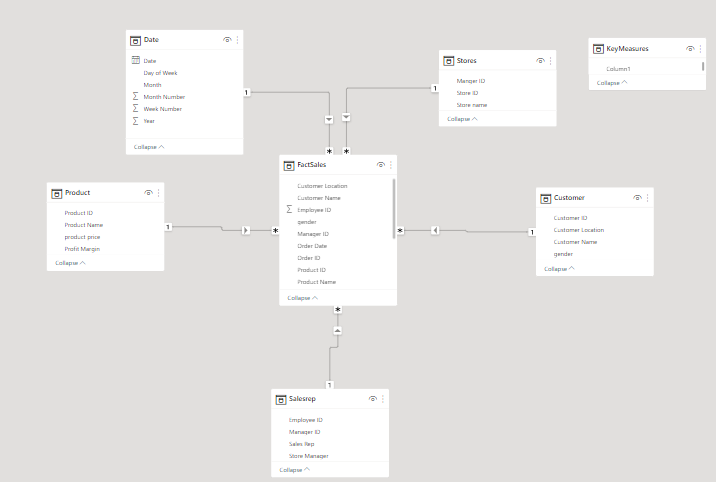
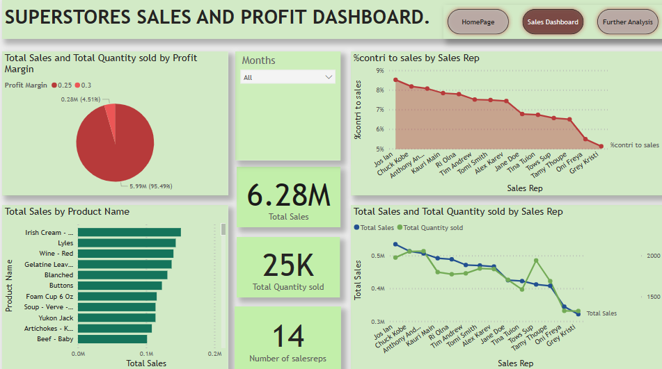

# Superstore Sales Analysis

## Introduction
This is a power BI Project on sales analysis of an imaginary store and its branches called **Superstores**.
The project is to analyze and derive insights to answer crucial questions and help the stores make data driven decisions.
**_Disclaimer_** : _All datasets and reports do not represent any company, but just a dummy dataset to demonstrate capabilities of Power BI._

## Problem statement
1. Which of the stores have the highest impact on sales?
2. What is the percentage contribution of each sales reps on total profit?
3. Productivity of Managers in each store.
4. Who are the top customers?

## Skills and concepts demonstrated:

The following Power BI features were incorporated:
- Power query(data cleanup)
- DAX
- Quick measures
- Page Navigation
- Modelling
- Filters
- Tooltips
- Button

## Power query:
The dataset was cleaned up and transformed in power query before loading to PowerBI for modelling and analysing. The 5 dimension tables and fact tables was transformed.

The above Salesrep table is a dimension table that consists of 14 rows and 4 columns and it also shows the steps taken to transforn the dataset which includes :
- filter null values
- Removed bottom rows
- Promoted headers
- changed type
- Replaced value

The above Sales table is the fact table that consists of 986 rows and 17 columns and it also shows the steps taken to transforn the dataset which includes :
- filter null values
- Removed bottom rows
- Promoted headers
- changed type
- Removed columns
- Renamed columns
- split column by delimiter

The other tables didnot need too much transformation.

## Modelling:
The automatically derived relationships are adjusted to replace unwanted relationships with the required.

The model is a star schema.
There are 5 dimension tables and 1 fact table. The dimension tables are all joined to the fact table with a one-to-many relationship. 

## Visualization:

The report comprises 3 pages:
1. Homepage
2. Sales Dashboard
3. Further analysis

You can interact with the report here (Link to Power BI service) (https://app.powerbi.com/groups/me/reports/68b3d710-94db-42b1-9e97-c58718e2a3ed/ReportSection)

Features:
- Imported background picture from the internet.
- There are three buttons on the homepage, labeled: homepage, sales dashboard and further analysis, the have hovering effects and each navigates the page with similar names.

Sales Dashboard: 

- The total sales for the stores is 6.28 million.
- 25,000 products were sold in the current year.
- The highest income was generated in April.
- Number of sales reps is 14.
- Irish cream(baileys) is the highest product sold with a total of 150,815.70.
- Jos ian is the most productive sales rep.
- There is intermittent rise and fall in the income of the stores accross months. 

Further Analysis: 

- Gamma C store has the highest gross income generated with 29.28% of the total sales of Superstores.
- Manager 4 of Gamma C store is the most productive manager in Superstores.
- The total number of customers that patronised the stores is 369.
- There are 113 products in the stores.

## Conclusion :

- Gamma C store has the highest impact on the income although relatively negligible. 😏
- Manager 4 and his sales representative have the major contribution to the income.

## Recommendations :

For an indepth analysis, the datasets from the previous  years will be needed for logical comparisons and data driven decisions.  

